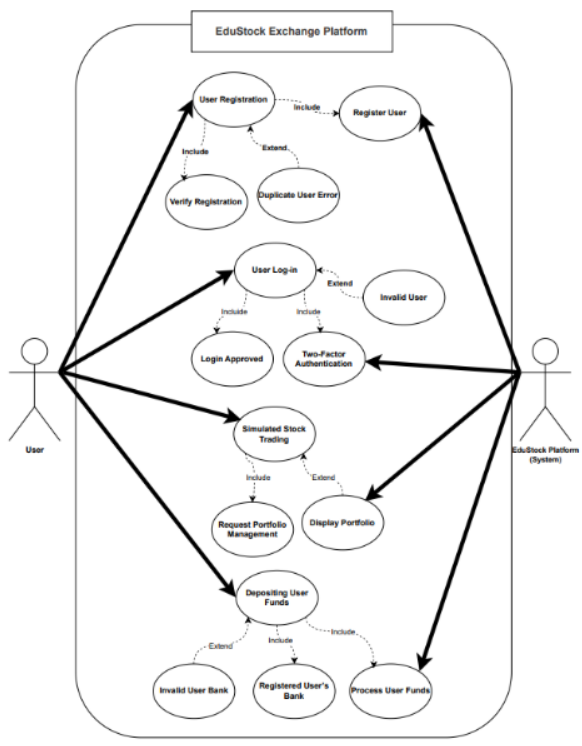
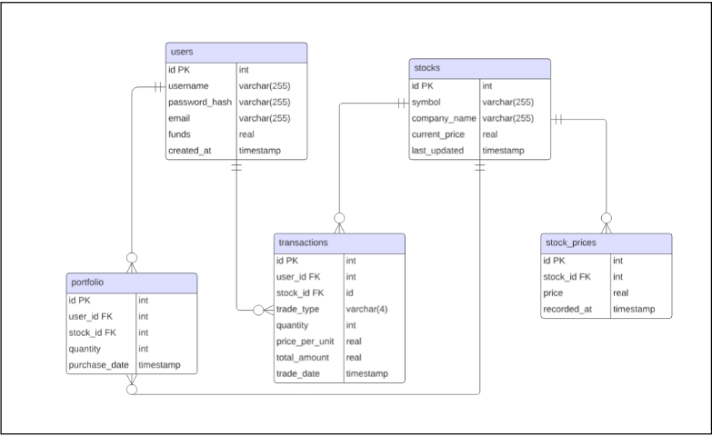
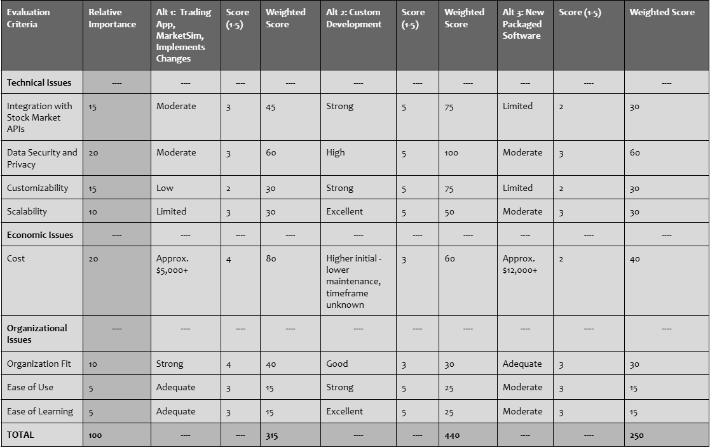
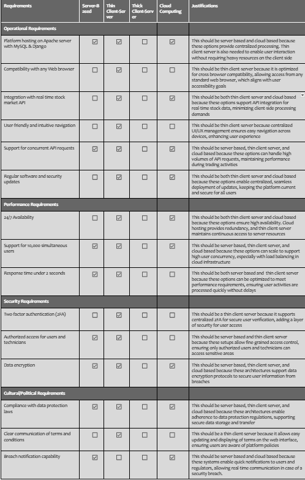
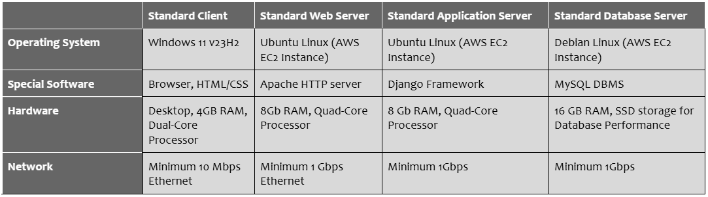
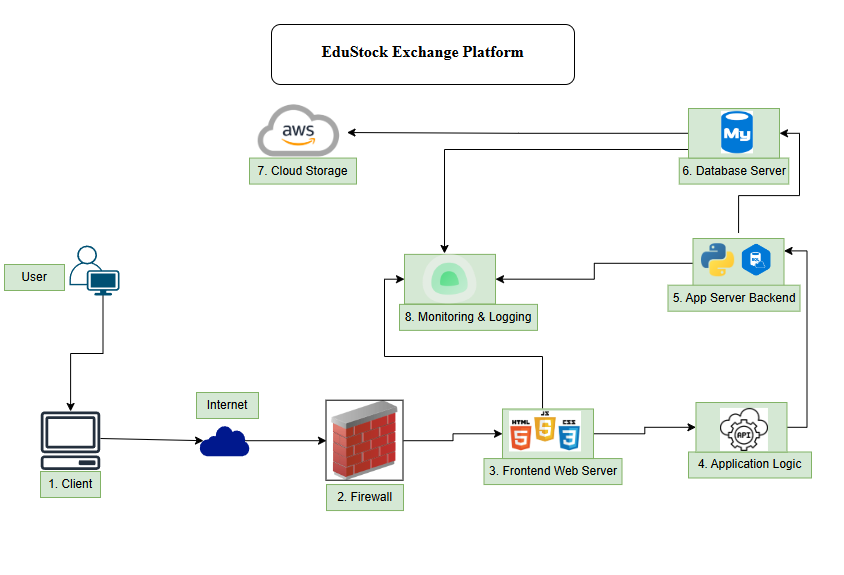
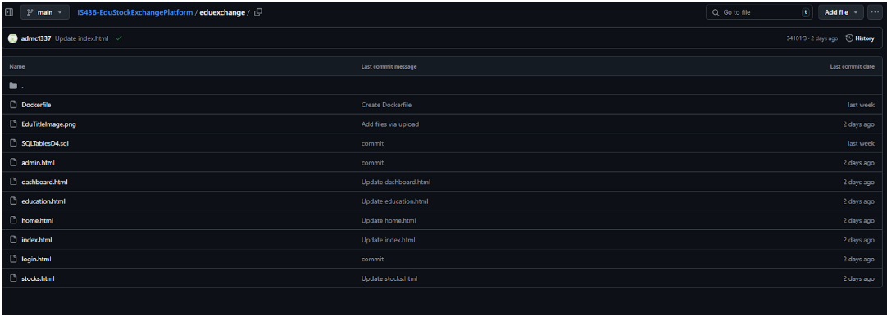
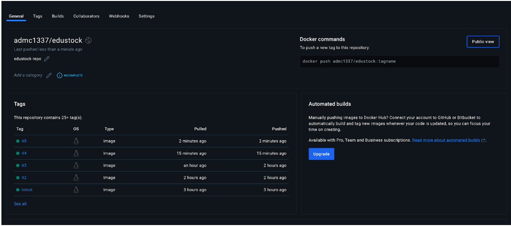

# EduStock Exchange Platform
This is the implementation of the System designed for the IS 436 class in Fall 2024.

## Table of Contents
* [Description](#description)
* [Phases of System Design](#phases-of-system-design)
    * [System Request](#phase-1-system-request)
    * [Requirements Definition Document and Use Cases](#phase-2-requirements-definition-document-and-use-cases)
    * [Process Modeling](#phase-3-process-modeling)
    * [Data Modeling and Starting Design](#phase-4-data-modeling-and-starting-design)
    * [User Interface Design, Program design and System Implementation](#phase-5-user-interface-design-program-design-and-system-implementation)
* [Using the Application](#using-the-application)
* [Technologies Used](#technologies-used)
* [Contributors](#contributors)
* [Help](#help)
* [License](#license)


## Description
The EduStock Exchange Platform is a risk-free, educational tool that allows users to simulate stock trading in a real-world-like environment. It is designed for university students and individuals interested in learning about stock market trading and portfolio management. The platform integrates real-time stock market data and offers key functionalities such as user account management, trading simulations, portfolio tracking, and educational resources. It is built with a focus on accessibility, scalability, and security.

The system architecture follows a Thin Client-Server model supplemented with Cloud Support to ensure high availability, scalability, and secure handling of user data.

## Phases of System Design
The designing of this system went through five phases. The phases were as follows:
1. System Request - In this phase, we completed a system request. This included the business need, business requirements, business value, special issues or constraints, feasibility analysis, cost-benefit analysis, and the project methodology.
1. Requirements Definition Document and Use Cases - In this phase, we defined functional and non-functional requirements with supporting documentation. Supporting documentation included interviews, observations, questionnaires, and document analysis. We also completed the use case diagram and detailed each use case.
1. Process Modeling - In this phase, we designed diagrams for the system processes. These included the context, level 0, and level 1 diagrams. We also included text definitions for each level 1 diagram.
1. Data Modeling and Starting Design - In this phase, we built and defined the entity-relationship diagram. We also wrote SQL scripts, displayed database tables, completed an alternative matrix and non-functional requirements and architectures with justification, charted hardware and software specifications, and designed the system architecture diagram.
1. User Interface Design, Program design and System Implementation - In this phase, we implemented the system. We developed wireframes for each webpage and hosted the system using Docker.

## Phase 1: System Request
The organization requires an educational tool that enables users to learn stock trading in a real-world environment without financial risk. Beginners will use this platform to understand market dynamics, foster financial literacy, and potentially attract a new user base interested in economic education.

**Business Requirements:**
* User Account Management
    * Allow users to create and manage accounts.
    * Provide an initial amount of virtual money upon account creation.
    * Enable users to add additional virtual funds manually.
* Real-Time Stock Data Integration
    * Integrate with a stock market API to fetch live stock data.
    * Display current market conditions and stock prices.
* Trading Functionality:
    * Implement features to buy and sell stocks using virtual money.
    * Update user portfolios based on trading activities.
    * Provide transaction histories and portfolio performance analytics.
* Educational Resources:
    * Offer tutorials, tips, and explanations of trading concepts
    * Include market news and analysis tools.
* Security and Compliance:
    * Ensure data privacy and secure transactions. 
    * Comply with relevant regulations regarding financial simulations.

**Business Value:**
* Educational Advancement:
    * Enhances user's understanding of stock trading and market behaviors.
    * Encourages financial literacy and responsible investment practices.
* Market Differentiation:
    * Shows the organization as a leader in innovative financial education tools.
    * Attracts a wider audience interested in finance and technology.
* Potential Revenue Streams:
    * Opens opportunities for monetization through advertisements or premium features.
    * Increases user engagement, leading to potential partnerships or sponsorships.

**Special Issues or Constraints:**
* API Limitations:
    * Dependence on third-party stock market APIs may introduce rate limits or costs.
    * Need to ensure API reliability and data accuracy.
* Legal and Regulatory Compliance:
    * Must avoid misrepresentation and adhere to laws concerning financial simulations.
    * Ensure transparency that the platform is for educational purposes only.
* Scalability and Performance:
    * The platform should handle high traffic and real-time data processing.
    * Plan for scalability to accommodate growing user bases.

**Feasibility Analysis:**
* Technical Feasibility:\
We need to ensure all parts of the system are compatible and run smoothly without error. The web application will be user-friendly and if users have questions, there will be a FAQ section. One risk we face is the difficulty of integrating different technical aspects of the system, such as the real-time stock data API, the SQL database for storing user information, and the frontend interface. These integrations could present challenges, such as data inconsistencies or API limitations. However, with thorough testing, proper documentation, and well-defined data-handling strategies, we can mitigate these risks and ensure a stable and efficient platform.

* Economic Feasibility:\
We will be implementing different technical features that will increase the overall cost of the project. However, these increased costs are justified as they will make the application more appealing to users, especially with enhanced security measures. Since the web application is free to users, we face the risk of not seeing any profit. Nonetheless, offering the web application at no cost can boost user interaction and engagement, which may lead to revenue through premium features and advertisements in the future.

* Organizational Feasibility:\
We have an experienced team that will be able to achieve our goal of building an application to educate users on investing. All team members are responsible for different aspects of the system. We could encounter the risk of not meeting the expectations of the project but we can prevent this by maintaining communication between teams.

**Cost-Benefit Analysis (3-year Plan starting 2024):**

**Costs:**
* Development Costs (2024):
    * Initial costs include platform development, API integration for real-time stock data, and setting up the infrastructure (cloud hosting, databases, and security).
    * Estimated Cost: $50,000.
* Maintenance & Upgrades (2025-2026):
    * Continuous development and upgrades, scaling the infrastructure, and covering API usage costs as the user base grows.
    * Estimate Yearly Cost: $30,000 per year.

**Benefits:**
* User Growth:
    * 2024: Focus on user acquisition with an estimated 10,000 users (free platform).
    * 2025: Monetization begins through ads and premium features, projected at 50,000 users (10% premium).
    * 2026: Platform expansion with 100,000 users (20% converting to premium).

* Revenue Projections:
    * 2025: $35,000 from ads and premium subscriptions.
    * 2026: $90,000 from ads and premium subscriptions.

**Net Benefit:**
* 2024: $50,000 loss due to development costs.
* 2025: $5,000 profit (revenue of $35,000 minus costs of $30,000).
* 2026: $60,000 profit (revenue of $90,000 minus costs of $30,000).

**Break-Even Point:** Expected by mid-2025, when the cumulative revenue surpasses the initial development costs.

**Project Methodology:**\
For this project, the most appropriate and efficient methodology would be the SCRUM method. SCRUM methodology is an agile team collaboration framework that is used most commonly in areas such as software development by breaking tasks into ‘time-boxed’ iterations. The platform involves multiple features such as account management, real-time data integration, trading, and educational resources. Due to the complexity of these, it would be more feasible to work in iterations in SCRUM before synthesizing. The features can be tested and developed in iterations so they can be regularly adjusted to fit user needs. SCRUM also offers progress tracking to help keep teams organized and on schedule with the time-sensitive features native to the EduStock platform.

<br>

## Phase 2: Requirements Definition Document and Use Cases
**Functional Requirements**
* Process-Oriented Requirements
    * User Account Management:
        * It lets users create an account with an email and password
        * Allow users to reset passwords if need be
        * Automatically give users an initial amount of money on account creation
        * Provide users an interface to add virtual money manually
        * Display the user’s portfolio with account balances, assets, and transaction histories
    * Real-Time Stock Data Integration:
        * Fetch live stock data from third-party stock market API
        * Display real-time stock prices and market trends
        * Update stock market data regularly to get accurate and current conditions
    * Trading Functionality:
        * Let users buy and sell stocks using virtual money
        * Allow users to view and manage current stock holdings in their portfolio
        * Update the user’s portfolio and balance after each trade
        * Maintain a record of user’s transactions with stock prices, how many stocks, and timing of trades
    * Educational Resources:
        * Provide access to tutorials and educational content on stock trading, market behavior, and trading tips
        * Offer an interactive guide for beginners to learn the stock market fundamentals
* Information-Oriented Requirements
    * User Information
        * Store user account information such as usernames, passwords, and portfolio data
        * Track trading activities, such as stock bought and sold and virtual money balance
    * Stock Data
        * Store real-time stock data fetched from API
        * Record stock data for each user’s transaction history
    * Educational Content
        * Store educational material, articles, and tutorials on stock trading and financial literacy/information

**Non-Functional Requirements**
* Operational
    * Any Web browser should be compatible with the system.
    * The system should integrate with a stock market API.
    * The system should be user friendly and allow for simple navigation in the trading process.
* Performance
    * The system should be accessible to users 24 hours a day and 365 days a year.
    * The system supports 10,000 users simultaneously without a delay in performance.
    * The response time for user activities should be less than 2 seconds.
* Security
    * The system utilizes two-factor authentication to keep user information protected.
    * The system is only accessible to authorized users and technicians when needed.
    * User data will be encrypted to decrease the likelihood of a security breach.
* Cultural/Political
    * The system is compliant with all data protection laws.
    * Terms and conditions are clearly communicated to users.
    * Users and regulatory bodies will be notified in the event of a security breach.

**Supporting Documentation**

Conclusion from the Interviews:
* The interviews with these stakeholders provides valuable insights into the design and functionality of the EduStock Exchange web application platform. Key themes emerged around the need for real-time data integration, user-friendly design, educational resources for beginners, and gamification to boost user engagement. These inputs were critical in shaping both the functional and non-functional requirements of the system, ensuring it meets the diverse needs of users ranging from high school seniors to financial literacy program students in college.

Conclusion from the observation:
* Overall, the MarketSim app falls short in supporting beginners due to its complex setup, difficult interface, and lack of guidance. To address these issues, our EduStock Exchange Platform should prioritize ease of use, provide comprehensive educational content, and include engaging features that make learning fun and effective. This way, our platform can better serve as a learning tool for students new to the stock market.

Summary of Responses from Questionnaire:
* Stock Market Familiarity: 59% (16 out of 27) of respondents reported having little to no knowledge of the stock market, indicating a strong need for beginner-friendly content and guided learning resources.
* Simulation Experience: Only 26% (7 out of 27) of respondents had used a trading simulation before, showing that most students are unfamiliar with such platforms.
* Preferred Learning Resources: 52% (14 out of 27) preferred interactive tutorials and hands-on exercises, while 30% (8 out of 27) preferred video content.
* Feature Preferences: The most requested features were real-time stock trading simulations, 74% of users voted  (20 out of 27) and step-by-step guides, 67% voted (18 out of 27).
* Challenges Identified: The top challenges included understanding complex financial terms, 63% of users voted (17 out of 27) and lack of practical application opportunities, 56% of users voted (15 out of 27).

Key Insights and Conclusion from Document Analysis: 
* The knowledge gained from the documents and report that were analyzed  show a clear need for an educational platform that bridges the gap in financial literacy, supports equity in learning, and incorporates global best practices. By making financial concepts and ideas more accessible to students and providing engaging, real-world simulations, the EduStock Exchange Platform can address the shortcomings found in the current financial education systems and empower all students to build essential financial skills.

**Use Case Diagram**


**Use Case Documents:**

Use Case 1:
---

**Use Case Name:** User Log-in **ID:** UC-1 **Priority:** Medium
                

**Actor:** Registered User, User Database

**Description:** This use case describes the process by which a registered user logs into the EduStock Exchange Platform to access their account and start trading.

**Trigger:** The user visits the platform and selects the "Log In" option from the homepage.

**Type:**   
* [x] External
* [ ] Temporal
---    
**Preconditions:**
* The user must already be registered on the platform with valid credentials (username/email and password).
* The platform is operational and available.
--- 
**Normal Course:**
1. The user selects "Log In" on the homepage.
2. The system prompts the user to enter their username/email and password.
3. The user inputs their credentials and clicks the "Submit" button.
4. The system verifies the credentials against the stored user data in the database.
5. If the credentials are correct, the system logs the user in and redirects them to their dashboard.
6. The dashboard displays the user’s portfolio, available virtual funds, and recent market data.
---  
**Postconditions:**
* The user is logged in, and the system grants access to the trading dashboard.
* The system displays an error message, and the user is prompted to retry.

<br>


Use Case 2:
---

**Use Case Name:** Two-Factor Authentication **ID:** UC-2 **Priority:** High
                

**Actor:** Registered User, Authentication Service

**Description:** This use case describes the process where a user will log in to the EduStock platform using valid credentials and will then be prompted to enter a verification code that was sent to them either via SMS or Email.

**Trigger:** The use case will initiate when registered user attempts to log in with valid credentials.

**Type:**   
* [x] External
* [ ] Temporal
---    
**Preconditions:**
* The user must have an active account on the EduStock Exchange Platform.
* The user must have enabled 2FA in their account settings.
* The system must have the user's verified email or phone number to send the authentication code.
--- 
**Normal Course:**
1. User enters login credentials (username and password) and submits the form.
1. System validates credentials and, if correct, prompts the user for 2FA.
1. System generates a one-time code and sends it to the user's email or phone.
1. User receives the code and enters it in the system's 2FA prompt.
1. System verifies the entered code within the allowed time limit.
1. Users are granted access to their account upon successful verification.
---  
**Postconditions:**
* **Success:** The user gains full access to the platform after successfully completing 2FA.
* **Failure:** If the code is incorrect or expires, access is denied, and the user must request a new code or try again. After multiple failed attempts, the system may temporarily lock the user out for security reasons.

<br>

Use Case 3:
---

**Use Case Name:** Depositing User Funds **ID:** UC-3 **Priority:** High
                

**Actor:** Registered User, User’s Bank

**Description:** This use case describes the process by which a user deposits funds (virtual or real) into their account on the EduStock Exchange Platform, allowing them to participate in simulated stock trading with additional capital.

**Trigger:** User initiates a deposit process by selecting deposit funds in their wallet and opting to deposit either real world currency or digital funds for simulation purposes.

**Type:**   
* [x] External
* [ ] Temporal
---    
**Preconditions:**
* The user must have an active account on the EduStock Exchange Platform.
* The user is logged into the platform.
* The user has a valid payment method (for real transactions) or access to virtual funds (for simulation purposes).
--- 
**Normal Course:**
1. User navigates to the account or wallet section of the platform.
1. User selects the option to deposit funds.
1. System prompts the user to enter the amount they wish to deposit (virtual funds for simulation or real currency, depending on system setup).
1. User selects a payment method or confirms virtual funds transfer.
1. System processes the request:
    * If real funds: System interacts with the payment gateway to complete the transaction.
    * If virtual funds: System updates the user’s virtual balance.
1. System confirms the deposit and updates the user's account balance.
1. User receives a confirmation message that the funds have been successfully deposited.
---  
**Postconditions:**
* **Success:** The user’s account balance is updated with the deposited funds (virtual or real).
* **Failure:** If the transaction fails (e.g., due to insufficient balance or technical issues), the system notifies the user of the error, and no funds are added.

<br>

Use Case 4:
---

**Use Case Name:** Simulated Stock Trading **ID:** UC-4 **Priority:** High
                

**Actor:** Registered User

**Description:** This use case describes the process by which a registered user buys or sells stocks on the EduStock Exchange Platform using virtual funds, simulating real-world stock trading.

**Trigger:** The user selects a stock to trade and initiates a buy or sell order on the platform.

**Type:**   
* [x] External
* [ ] Temporal
---    
**Preconditions:**
* The user must have an active account on the platform.
* The user is logged into the platform.
* The user has sufficient virtual funds in their account to place a buy order or stocks in their portfolio to place a sell order.
* The platform has access to real-time stock market data through an integrated API.
--- 
**Normal Course:**
1. The user navigates to the "Trading Dashboard."
1. The system displays available stocks with real-time data, including prices.
1. The user selects a stock they wish to buy or sell.
1. The system prompts the user to enter the number of shares and the type of transaction (buy/sell).
1. The user confirms the transaction.
1. The system checks if the user has sufficient funds (for buy) or the required shares (for sell).
1. If valid, the system processes the transaction:
    * For a buy transaction: The system deducts the virtual funds from the user's account and adds the shares to their portfolio.
    * For a sell transaction: The system deducts the shares from the user's portfolio and credits the virtual funds to their account.
1. The system updates the user's transaction history and portfolio.
1. The user receives a confirmation message that the transaction has been successfully completed.
---  
**Postconditions:**
* **Success:** The user's portfolio and virtual funds are updated according to the completed transaction. A confirmation message is shown, and the user's transaction history is logged.
* **Failure:** If the transaction fails (e.g., insufficient funds, invalid stock selection), the system notifies the user of the issue, and no changes are made to the account or portfolio.

<br>

Use Case 5:
---

**Use Case Name:** Portfolio Management **ID:** UC-5 **Priority:** Medium
                

**Actor:** Registered User, System, Stock Data API, User Database

**Description:** This use case describes how a registered user views and manages their portfolio, which includes their current stock holdings, available virtual funds, and transaction history on the EduStock Exchange Platform.

**Trigger:** The user selects the "Portfolio" option from the dashboard.

**Type:**   
* [x] External
* [ ] Temporal
---    
**Preconditions:**
* The user must have an active and logged-in account.
* The platform must have stored portfolio data for the user.
* Stock data from the API must be available.
--- 
**Normal Course:**
1. The user navigates to the "Portfolio" section on the dashboard.
1. The system retrieves the user's portfolio details from the user database.
1. The system fetches real-time stock prices from the Stock Data API.
1. The portfolio is displayed with updated stock prices, holdings, and available funds.
1. The user can select the "Transaction History" tab to view a list of past trades, which is retrieved from the user database.
1. The system displays the user's transaction history.
---  
**Postconditions:**
* **Success:** The portfolio and transaction history are displayed, showing up-to-date stock values and accurate account balances.
* **Failure:** If data retrieval fails, an error message is displayed, and no portfolio data is shown.


## Phase 3: Process Modeling
[Diagrams from D3](D3_Diagrams.pdf)


**Text Definitions for Level 1 Diagrams:**

Process 1: Level 1\
User Account Management 

* **Processes:**
    * Process 1: User Account Management
        * This process takes inputs from the User entity (E1) and interacts with the User Database (D1) and User Activity Log (D5) data stores to allow users to register, log in, update their profiles, and recover passwords securely. The outputs from this process include login responses and password reset confirmations, which are sent back to the User entity (E1).
    * Process 1.1: User Registration
        * This process captures new user information; email, password, and profile information, and sends a confirmation email to verify user identity.
    * Process 1.2: User Login
        * This process verifies the users email and password with the system, and retrieves the user roles to personalize the user experience.
    * Process 1.3: Profile Management
        * This process allows users to view and update their personal information, like passwords and preferences, and provides access to previous activities like trades and learning content.
    * Process 1.4: Password Recovery
        * This process generates a secure password recovery link and send it by email, and allows users to reset their passwords securely.
* **Entities:**
    * E1. User:
        * This entity is the user making requests like registration, login, and profile updates.
* **Datastores:**
    * D1: User Database
        * This datastore stores user credentials, profile details, and roles, and maintains password recovery data.
    * D5: User Activity Log
        * This datastore maintains login history.
* **Data Flows:**
    * F1: Registration Data
        * This data flow is input from the User entity (E1) to User Registration (1.1), which occurs when a user submits their registration information. The data is stored in the User Database (D1).
    * F2. Login Request:
        * This data flow is input from the User entity (E1) to User Login (1.2), which occurs when a user inputs an email and password for authentication.
    * F3. Login Response:
        * This data flow is output from User Login (1.2) to the User entity (E1), which occurs after the system processes the login request and responds with a successful or error message.
    * F4. Profile Update Request:
        * This data flow is input from the User entity (E1) to Profile Management (1.3), which occurs when a user submits new profile details like an updated password or personal information.
    * F5. Profile Data Update:
        * This data flow is output from Profile Management (1.3) to the User Database (D1), which occurs when updated profile information is saved in the user database.
    * F6. Password Recovery Request:
        * This data flow is input from the User entity (E1) to Password Recovery (1.4), which occurs when a user requests to reset their password by entering the registered email.
    * F7. Password Reset Confirmation:
        * This data flow is output from Password Recovery (1.4) to the User entity (E1), which occurs after the user successfully resets their password using the reset link.
    * F8. Login History Update:
        * This data flow is output from User Login (1.2) to the User Activity Log (D5), which occurs after each successful login to maintain a login history in the database.

Process 2: Level 1\
Simulated Stock Trading

* **Processes:**
    * Process 2: Simulated Stock Trading
        * This process takes inputs from the User entity (E1) and interacts with the Stock Data API (E2), Stock Data Cache (D4), and Transaction Database (D2) to allow users to initiate and execute trades with real-time stock data. The process validates transactions, updates user portfolios, and confirms completed trades. The outputs from this process include real-time stock data updates and transaction confirmations, which are sent back to the User entity (E1). 
    * Process 2.1: Initiate Trade Request
        * This process receives a trade request from the user and validates the basic structure of the request, including the stock ID and trade type (buy or sell).
    * Process 2.2: Fetch real-Time Stock Data
        * This process obtains the most relevant current stock data by checking the stock data cache for any existing real-time data. If no data is available, the cache requests new data from the API.
    * Process 2.3: Validate Transaction 
        * This process validates the trade by synthesizing relevant data and checking if the user has available funds for buying or sufficient holdings for selling. If the funds or holdings are validated, the trade request is forwarded to execution.
    * Process 2.4: Execute Transaction
        * This process executes the validated trade, adds or subtracts funds from the user’s account, and holds the transaction details to be saved in the system.
    * Process 2.5: Update Portfolio and Transaction History
        * This process updates the user portfolio to reflect the completed transaction and stores the details in the transaction database for record-keeping purposes.

* **Entities:**
    * E1. User:
        * This entity is the user making requests like registration, login, and profile updates.
    * E2 Stock Data API:
        * This entity provides real-time market data to the EduStock Platform, including information such as prices, trading volumes, and portfolio updates.

* **Datastores:**
    * D2 Transaction Database:
        * This datastore stores transaction and trade details for each user, maintaining a running history of all trades.
    * D4 Stock Data Cache:
        * This datastore temporarily stores real-time stock data retrieved from the API, reducing the time needed to fetch repetitive data and making the platform more efficient.

* **Data Flows:**
    * F1: Receive trade request
        * This data flow is input from the User entity (E1) to the Initiate Trade Request (2.1) process, which occurs when the user sends a request to either buy or sell. The request includes a stock ID, trade type, and the number of shares.
    * F2: Validate stock data
        * This data flow is output from the Initiate Trade Request (2.1) process to the Validate Transaction (2.3) process, which occurs when the stock ID, trade type, and number of shares are passed for validation using the currently available stock data.
    * F3: Real-time request
        * This data flow is input from the Validate Transaction (2.3) process to the Stock Data Cache (D4), which occurs when the system checks the cache using the most recent stock data based on the stock ID.
    * F4: Return real-time stock data
        * This data flow is output from the Stock Data Cache (D4) to the User entity (E1), which occurs when real-time stock data is provided to the user.
    * F5: Real-time API request
        * This data flow is output from the Stock Data Cache (D4) to the Stock Data API (E2), which occurs when a request for live stock data is made if the cache does not have the most recent stock data.
    * F6: Real-time stock data request
        * This data flow is output from the Stock Data API (E2) to the Stock Data Cache (D4), which occurs when the API provides the most relevant stock data in response to the request.
    * F7: Update cache
        * This data flow is input from the Stock Data API (E2) to the Stock Data Cache (D4), which occurs when the cache is updated with the newest and most relevant stock data.
    * F8: Validated stock price
        * This data flow is output from the Stock Data Cache (D4) to the Validate Transaction (2.3) process, which occurs when the stock price is carried for validation.
    * F9: Transaction request
        * This data flow is output from the Validate Transaction (2.3) process to the Execute Transaction (2.4) process, which contains all the validated trade details and any other relevant transaction information.
    * F10: Transaction confirmation
        * This data flow is output from the Execute Transaction (2.4) process to the Update Portfolio and Transaction History (2.5) process, which confirms the execution of the trade and provides all details for updating the transaction and portfolio database.
    * F11: Update database
        * This data flow is input from the Update Portfolio and Transaction History (2.5) process to the Transaction Database (D2), which occurs when confirmed transaction details are stored.
    * F12: Confirm transaction
        * This data flow is output from the Update Portfolio and Transaction History (2.5) process to the User entity (E1), which occurs when a transaction confirmation, along with updated portfolio details and a trade summary, is sent to the user.

Process 3: Level 1\
Portfolio Management 

* **Processes:**
    * Process 3: Portfolio Management
        * This process takes the input Portfolio Data Request (F6) from the Users entity (E1). It interacts with the User Database (D1) and Transaction Database (D2) to provide the necessary information to build user portfolios. The portfolio data is then returned to the Users entity (E1).
    * Process 3.1: Update Stock Data	
        * This process allows real-time stock data to be delivered to the portfolio for users to view stock data trends.
    * Process 3.2: Build User Portfolio
        * This process allows administrators to assemble the user’s stock portfolio with the User Database (D1) and Transaction Database (D2) data stores.
    * Process 3.3: Display Portfolio
        * This process allows the user to view their stock portfolio including real-time stock data.


* **Entities:**
    * E1. User:
        * This entity represents users who can access their stock portfolio, which displays their stocks and current stock trends.

* **Datastores:**
    * D1: User Database
        * This datastore contains information about the user that is used to build their portfolio.
    * D2: Transaction Database
        * This datastore contains information about the user's transaction history, which is used to build their portfolio.


* **Data Flows:**
    * F1: User Portfolio Data
        * This data flow is input from the User Database (D1) to the Build User Portfolio (3.2) process, which occurs when the database shares user information to assist in building their portfolio.
    * F2: User Investment Data
        * This data flow is input from the Transaction Database (D2) to the Build User Portfolio (3.2) process, which occurs when the database shares the user’s investment information to assist in building their portfolio.
    * F3: User Portfolio
        * This data flow is input from the Build User Portfolio (3.2) process to the Display Portfolio (3.3) process, which occurs when the user’s portfolio is uploaded for the user to view.
    * F4: Live Stock Data
        * This data flow is input from the Transaction Database (D2) to the Update Stock Data (3.1) process, which occurs when real-time stock data is shared with the system.
    * F5: Stock Data Update
        * This data flow is output from the Update Stock Data (3.1) process to the Display Portfolio (3.3) process, which occurs when real-time stock data is updated into the portfolio for users to see live stock trends.
    * F6: Portfolio Data Request
        * This data flow is input from the Users entity (E1) to the Display Portfolio (3.3) process, which occurs when users request to view their stock portfolio.
    * F7: Portfolio Data Response
        * This data flow is output from the Display Portfolio (3.3) process to the Users entity (E1), which occurs when the user’s stock portfolio is delivered to them, allowing them to view real-time stock data along with their investment information.

Process 4: Level 1\
Educational Content Delivery

* **Processes:**
    * Process 4: Educational Content Delivery
        * This process takes inputs from the Users entity (E1) as Search Request (F4) and Information Request (F7). It interacts with the Educational Content Database (D3) to upload and provide users with access to educational content. The outputs from this process include educational content and search results, which are delivered back to the Users entity (E1).
    * Process 4.1: Search Educational Content
        * This process allows users to search for educational content related to stock trading. The search results are returned to users.
    * Process 4.2: Upload Educational Content
        * This process allows educational content to be uploaded for users to access. The educational content database (D3) is updated to include the new educational resources for users.
    * Process 4.3: Access Educational Content
        * This process allows users to access educational content from the educational content database (D3).

* **Entities:**
    * E1. User:
        * This entity represents users who request to search and access educational content.

* **Datastores:**
    * D3: Educational Content Database
        * This data store maintains and updates educational content for users.

* **Data Flows:**
    * F1: Content Update Request
        * This data flow is input from the Educational Content Database to the Upload Educational Content (4.2) process, which occurs when new educational content is requested to be included in the database for users to access.
    * F2: Educational Content Update
        * This data flow is output from the Upload Educational Content (4.2) process to the Educational Content Database (D3), which occurs when the database is updated with new educational content.
    * F3: Educational Content
        * This data flow is input from the Educational Content Database (D3) to the Access Educational Content (4.3) process, which occurs when users request to access educational content from the database.
    * F4: Educational Content
        * This data flow is input from the Educational Content Database (D3) to the Search Educational Content (4.1) process, which occurs when the database provides new educational content for users to search.
    * F5: Search Request
        * This data flow is input from the Users entity (E1) to the Search Educational Content (4.1) process, which occurs when users search the database to find learning resources.
    * F6: Search Response
        * This data flow is output from the Search Educational Content (4.1) process to the Users entity (E1), which occurs when learning resources are provided to users after searching the database.
    * F7: Information Request
        * This data flow is input from the Users entity (E1) to the Access Educational Content (4.3) process, which occurs when users request to view the learning resources provided by the database.
    * F8: Information Delivered
        * This data flow is output from the Access Educational Content (4.3) process to the Users entity (E1), which occurs when learning resources are delivered to users from the database.

Process 5: Level 1\
System Administration

* **Processes:**
    * Process 5: System Administration
        * The System Administration process takes inputs exclusively from the Admin entity and manages essential system functions. It interacts with the User Activity Log (D5) and Educational Content Database (D3) data stores to handle user account actions, manage educational content, retrieve system logs, and monitor user activities. Outputs from this process include confirmations and activity reports, sent back to Admin. 
    * Process 5.1: User Management
        * This process handles user-related requests from Admin, such as adding, updating, or deleting user profiles, and interacts with the User Activity Log (D5) to store user activities. Outputs include confirmation messages to Admin.
    * Process 5.2: Content Management
        * This process manages uploading and updating educational content, interacting with the Educational Content Database (D3) to store new and revised resources. Outputs include confirmation of content uploads or updates to Admin.
    * Process 5.3: Logging
        * This process retrieves system logs upon Admin's request, providing activity reports for monitoring purposes.
    * Process 5.4: Activity Monitoring
        * This process tracks and logs user actions in the system for accountability, storing data in the User Activity Log (D5). Outputs include activity reports sent to Admin.


* **Entities:**
    * E1: Admin
        * This entity represents administrators who are responsible for all management actions, including user administration, content management, logging, and activity monitoring.

* **Datastores:**
    * D3: Educational Content Database
        * This datastore stores all educational content for system use, supporting Content Management processes.
    * D5: User Activity Log
        * This datastore records user actions like logins, profile updates, and other activities, supporting User Management and Activity Monitoring processes.

* **Data Flows:**
    * F1: User Management Request
        * This data flow is input from Admin (E1) to User Management (Process 5.1), initiating actions like adding, updating, or deleting a user.
    * F2: User Management Confirmation
        * This data flow is output from User Management (Process 5.1) to Admin (E1), providing confirmation of the requested action (e.g., user added, updated, or deleted).
    * F3: Content Upload Request
        * This data flow is input from Admin (E1) to Content Management (Process 5.2), indicating a request to upload or update educational content.
    * F4: Content Update Confirmation
        * This data flow is output from Content Management (Process 5.2) to Admin (E1), confirming that the content was successfully uploaded or updated.
    * F5: System Log Request
        * This data flow is input from Admin (E1) to Logging (Process 5.3), requesting system logs for review.
    * F6: System Log Data
        * This data flow is output from Logging (Process 5.3) to Admin (E1), containing the requested system logs.
    * F7: Activity Monitoring Request
        * This data flow is input from Admin (E1) to Activity Monitoring (Process 5.4), requesting an activity report or monitoring of user activities.
    * F8: User Activity Report
        * This data flow is output from Activity Monitoring (Process 5.4) to Admin (E1), providing details on recent user activities for review.
    * F9: Store User Activity
        * This data flow is output from User Management (Process 5.1) to the User Activity Log (D5), storing records of user actions, such as logins and profile changes.
    * F10: Log User Activity
        * This data flow is output from Activity Monitoring (Process 5.4) to the User Activity Log (D5), maintaining a log of ongoing user activities in the system.
    * F11: Store Educational Content
        * This data flow is output from Content Management (Process 5.2) to the Educational Content Database (D3), storing new or updated educational content.


## Phase 4: Data Modeling and Starting Design

**Entity-Relationship Diagram**

ERD Components:

* User
    * Identifier(s):
        * Id
    * Attributes:
        * username
        * password_hash
        * email
        * funds
        * created_at
    * Relationships:
        * One-to-Many with Portfolio
        * One-to-Many with Transactions
* Stocks
    * Identifier(s):
        * id
    * Attributes:
        * symbol
        * company_name
        * current_price
        * last_updated
    * Relationships:
        * One-to-Many with Transactions
        * One-to-Many with Portfolio
        * One-to-Many with Stock Prices
* Portfolio
    * Identifier(s):
        * id
    * Attributes:
        * user_id (Foreign Key referencing User)
        * stock_id (Foreign Key referencing Stocks)
        * quantity
        * purchase_date
    * Relationships:
        * Many-to-One with User
        * Many-to-One with Stocks
* Transactions
    * Identifier(s):
        * id
    * Attributes:
        * user_id (Foreign Key referencing User)
        * stock_id (Foreign Key referencing Stocks)
        * trade_type (buy/sell)
        * quantity
        * price_per_unit
        * total_amount
        * trade_date
    * Relationships:
        * Many-to-One with User
        * Many-to-One with Stocks
* Stock Prices
    * Identifier(s):
        * id
    * Attributes:
        * stock_id (Foreign Key referencing Stocks)
        * price
        * recorded_at
    * Relationships:
        * Many-to-One with Stocks

ERD Diagram:



**SQL Scripts:**
```
-- Active: 1731442246085@@127.0.0.1@3306@EdustockDB

CREATE TABLE users (
    id INTEGER PRIMARY KEY AUTO_INCREMENT,
    username VARCHAR(255) NOT NULL UNIQUE,
    password_hash VARCHAR(255) NOT NULL,
    email VARCHAR(255) NOT NULL UNIQUE,
    funds REAL DEFAULT 0.0,
    created_at TIMESTAMP NOT NULL DEFAULT CURRENT_TIMESTAMP
);

CREATE TABLE stocks (
    id INTEGER PRIMARY KEY AUTO_INCREMENT,
    symbol VARCHAR(255) NOT NULL UNIQUE,
    company_name VARCHAR(255) NOT NULL,
    current_price REAL,
    last_updated TIMESTAMP NOT NULL DEFAULT CURRENT_TIMESTAMP
);

CREATE TABLE portfolio (
    id INTEGER PRIMARY KEY AUTO_INCREMENT,
    user_id INTEGER NOT NULL,
    stock_id INTEGER NOT NULL,
    quantity INTEGER NOT NULL,
    purchase_date TIMESTAMP NOT NULL DEFAULT CURRENT_TIMESTAMP NOT NULL,
    FOREIGN KEY (user_id) REFERENCES users(id),
    FOREIGN KEY (stock_id) REFERENCES stocks(id)
);

CREATE TABLE transactions (
    id INTEGER PRIMARY KEY AUTO_INCREMENT,
    user_id INTEGER NOT NULL,
    stock_id INTEGER NOT NULL,
    trade_type VARCHAR(4) CHECK(trade_type IN ('buy', 'sell')) NOT NULL,
    quantity INTEGER NOT NULL,
    price_per_unit REAL NOT NULL,
    total_amount REAL NOT NULL,
    trade_date TIMESTAMP NOT NULL DEFAULT CURRENT_TIMESTAMP NOT NULL,
    FOREIGN KEY (user_id) REFERENCES users(id),
    FOREIGN KEY (stock_id) REFERENCES stocks(id)
);

CREATE TABLE stock_prices (
    id INTEGER PRIMARY KEY AUTO_INCREMENT,
    stock_id INTEGER NOT NULL,
    price REAL NOT NULL,
    recorded_at TIMESTAMP NOT NULL DEFAULT CURRENT_TIMESTAMP NOT NULL,
    FOREIGN KEY (stock_id) REFERENCES stocks(id)
);


INSERT INTO users (username, password_hash, email, funds, created_at) 
VALUES ('alice', 'hashedpasswordA', 'alice@example.com', 1200.50, '2024-11-10 09:00:00');

INSERT INTO users (username, password_hash, email, funds, created_at) 
VALUES ('bob', 'hashedpasswordB', 'bob@example.com', 3500.00, '2024-11-10 10:00:00');

INSERT INTO users (username, password_hash, email, funds, created_at) 
VALUES ('carol', 'hashedpasswordC', 'carol@example.com', 500.75, '2024-11-10 11:00:00');

INSERT INTO stocks (symbol, company_name, current_price, last_updated) 
VALUES ('TSLA', 'Tesla, Inc.', 700.00, '2024-11-10 12:00:00');

INSERT INTO stocks (symbol, company_name, current_price, last_updated) 
VALUES ('AMZN', 'Amazon.com, Inc.', 3300.00, '2024-11-10 12:30:00');

INSERT INTO stocks (symbol, company_name, current_price, last_updated) 
VALUES ('GOOGL', 'Alphabet Inc.', 2800.00, '2024-11-10 13:00:00');

INSERT INTO portfolio (user_id, stock_id, quantity, purchase_date) 
VALUES (1, 1, 3, '2024-11-10 13:30:00');

INSERT INTO portfolio (user_id, stock_id, quantity, purchase_date) 
VALUES (2, 2, 5, '2024-11-10 14:00:00');

INSERT INTO portfolio (user_id, stock_id, quantity, purchase_date) 
VALUES (3, 3, 2, '2024-11-10 14:30:00');

INSERT INTO transactions (user_id, stock_id, trade_type, quantity, price_per_unit, total_amount, trade_date) 
VALUES (1, 1, 'buy', 3, 700.00, 2100.00, '2024-11-10 15:00:00');

INSERT INTO transactions (user_id, stock_id, trade_type, quantity, price_per_unit, total_amount, trade_date) 
VALUES (2, 2, 'sell', 2, 3300.00, 6600.00, '2024-11-10 15:30:00');

INSERT INTO transactions (user_id, stock_id, trade_type, quantity, price_per_unit, total_amount, trade_date) 
VALUES (3, 3, 'buy', 1, 2800.00, 2800.00, '2024-11-10 16:00:00');

INSERT INTO stock_prices (stock_id, price, recorded_at) 
VALUES (1, 700.00, '2024-11-10 10:00:00');

INSERT INTO stock_prices (stock_id, price, recorded_at) 
VALUES (2, 3300.00, '2024-11-10 10:30:00');

INSERT INTO stock_prices (stock_id, price, recorded_at) 
VALUES (3, 2800.00, '2024-11-10 11:00:00');


```

[SQL Tables](SQL_Tables.pdf)

**Alternative Matrix**

Defining Evaluation Criteria:
* Integration with Stock Market APIs
    * The ability to seamlessly connect with real-time stock market data sources, ensuring accurate and timely updates for user portfolios.
* Data Security and Privacy
    * The system's capability to securely store, manage, and protect user information and financial data, is essential for maintaining trust and compliance.
* Customizability
    * The degree to which the system can be modified and expanded to meet specific project requirements and accommodate future feature updates.
* Scalability
    * The capacity of the system to support an increasing number of users and a growing volume of data without compromising performance.
* Cost
    * The initial and ongoing costs associated with developing, implementing, and maintaining the platform impact the project’s budget feasibility.
* Organization Fit
    * How well the system aligns with the project’s goals and the team’s ability to manage, operate, and sustain the system within the organization.
* Ease of Use
    * The usability and user experience
* Ease of Learning
    * How quickly users can learn how to maneuver through the system

**Team Matrix**


**Justification**

Chosen Alternative: Alt 2: Custom Development

We chose custom development as the preferred alternative because it best meets our evaluation criteria, allowing us to build the system from the ground up based on the specific requirements we have identified. This approach also has the potential to be the most cost-effective solution in the long term. While the first alternative, where the trading simulation app, MarketSim, would implement changes, scored closely, custom development stands out due to its flexibility in enabling modifications and its enhancement of ease of use, making it the clear choice.

**Non-Functional Requirements and Architectures**



**Justification**

Chosen Architecture: Thin Client-Server with Cloud Support

The thin client-server architecture, supported by cloud computing, is the most suitable for the EduStock Exchange Platform. This architecture meets key non-functional requirements, such as high availability, scalability, and simplified deployment. Cloud support provides redundancy and allows the system to manage peak loads efficiently, ensuring consistent performance during high user activity. Centralized processing in the thin client-server model also enables essential security features, such as two-factor authentication (2FA), data encryption, compliance with data protection laws, safeguarding user information, and maintaining regulatory standards.

**Trade-offs:** This architecture relies on server processing, which may introduce latency under heavy load conditions. Additionally, user access may be affected if the server experiences downtime. However, cloud integration mitigates these risks by offering load balancing and failover options, enhancing reliability, and minimizing service interruptions. These advantages make Thin Client-Server with Cloud Support the best choice for our platform’s needs and requirements.

**Scalability:** To handle scalability, we leverage cloud computing to dynamically add more servers as needed, ensuring the platform can support high user traffic and process real-time stock market data from external APIs without performance issues. This approach enables the EduStock Exchange Platform to manage concurrent user loads efficiently. Additionally, combining a thin client-server architecture and cloud support ensures the platform remains responsive, accessible, and capable of scaling seamlessly as the user base and data demands grow. For example, if the platform needs to support 10,000 users, adding additional servers within the cloud would maintain optimal performance.

**Hardware and Software Specification**


**System Architecture Diagram**


## Phase 5: User Interface Design, Program design and System Implementation
[WireFrames](WireFrames.pdf)

**GitHub Code Repository**


[Link to Repository](https://github.com/wkazz246/IS436-EduStockExchangePlatform)

[Link to EduExchange Folder](https://github.com/wkazz246/IS436-EduStockExchangePlatform/tree/main/eduexchange)

**DockerHub Image**


[DockerHub Image URL](https://hub.docker.com/r/admc1337/edustock)

**Docker Hub Pull Command:** docker pull admc1337/edustock:45

**Example of a Run:** docker run -d -p 8080:80 admc1337/edustock:45

## Using the application
To use the EduStock Exchange Platform:
1. Open the application in any web browser.
1. Create an account or log in using your credentials.
1. Access educational resources to learn about stock trading.
1. Start trading stocks with virtual funds and manage your portfolio.

## Technologies Used
The project uses the following technologies:
- **Frontend**: HTML, CSS
- **Backend**: Django Framework, Python
- **Database**: MySQL (Docker)
- **Cloud Hosting**: AWS (Amazon Web Services)
- **Version Control**: Git/GitHub
- **Integration**: Real-time Stock Market API

## Contributors
| Name     | Role          |
| -------- | -------------- |
| Alejandro Diaz Meinecke | Backend Developer |
| Kidus Solomon | Database/Network Developer |
| Wardan Kazzalbach | Project Manager |
| Arham Ahmed | Systems Analyst |
| Izzie Powell | Frontend Developer/Lead Designer |

## Help
For any suggestions for common problems or issues please open an issue on github and we will look into your comments as soon as possible.

## License
This project has been intended for the use on a public facing webpage. It is to be used by university students or individuals looking to utilize some of the stock market teaching tools and resources we offer. Source code is available and is open to the public within the repository.


